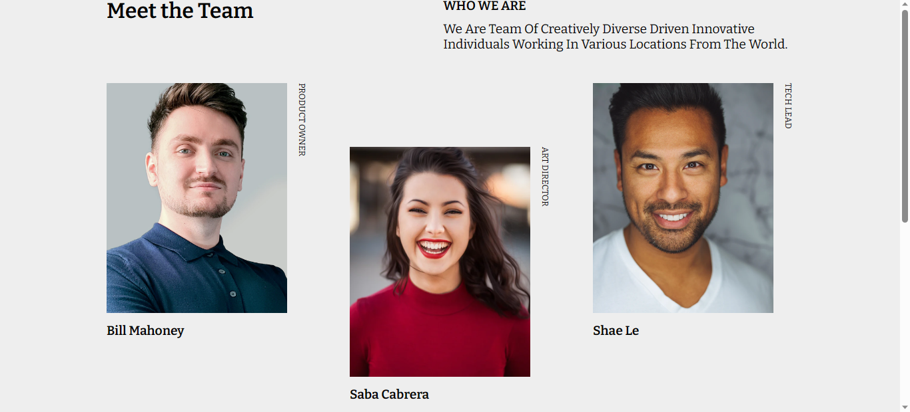

<h1 align="center">My Team Page</h1>

   Solution for a challenge from  <a href="http://devchallenges.io" target="_blank">Devchallenges.io</a>.

  <h3>
    <a href="https://flakobb.github.io/team-page/">
      Demo
    </a>
     | 
    <a href="https://github.com/FlakoBB/team-page">
      Solution
    </a>
     | 
    <a href="https://devchallenges.io/challenges/hhmesazsqgKXrTkYkt0U">
      Challenge
    </a>
  </h3>

<!-- TABLE OF CONTENTS -->

## Table of Contents

- [Overview](#overview)
  - [Built With](#built-with)
- [Features](#features)
- [Contact](#contact)

<!-- OVERVIEW -->

## Overview

Página estática que muestra tarjetas con información de el equipo de desarrollo de un proyecto. La distribucion de los elementos se hizo con **flex** y **grid**.

### Built With

- HTML
- CSS
	- flex
	- grid

## Features

This application/site was created as a submission to a [DevChallenges](https://devchallenges.io/challenges) challenge. The [challenge](https://devchallenges.io/challenges/hhmesazsqgKXrTkYkt0U) was to build an application to complete the given user stories.

## Contact

- Redes [Follow me](https://bit.ly/follow-flako)
- GitHub [@your-username](https://github.com/FlakoBB)
